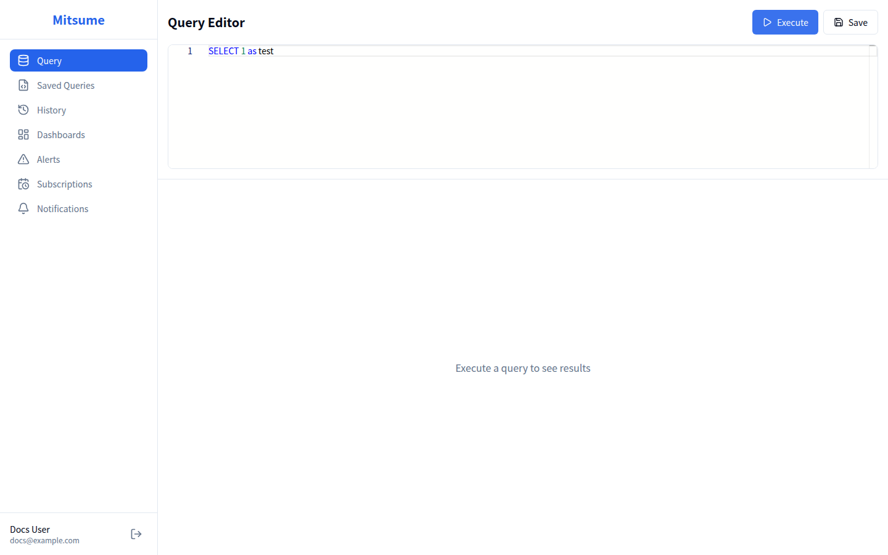

# Mitsume ドキュメント

Mitsume は Trino に接続して SQL クエリを実行する Web ベースの BI ツールです。
このドキュメントでは、利用者および管理者向けに各機能の使い方を説明します。

## 目次

### 利用者ガイド

日常的なデータ分析作業に必要な機能の使い方を説明します。

| ドキュメント | 説明 |
|-------------|------|
| [クエリエディタ](./user-guide/query-editor.md) | SQL クエリの作成・実行・エクスポート |
| [保存クエリ](./user-guide/saved-queries.md) | クエリの保存・管理・共有 |
| [クエリ履歴](./user-guide/history.md) | 過去の実行履歴の確認・再利用 |
| [ダッシュボード](./user-guide/dashboards.md) | ダッシュボードの作成・ウィジェット配置・チャート設定 |
| [アラート](./user-guide/alerts.md) | クエリ結果に基づく条件監視・通知設定 |
| [サブスクリプション](./user-guide/subscriptions.md) | ダッシュボードの定期配信設定 |
| [通知チャンネル](./user-guide/notification-channels.md) | Slack・メール・Google Chat への通知設定 |

### 管理者ガイド

システム管理者向けの機能を説明します。

| ドキュメント | 説明 |
|-------------|------|
| [ユーザー管理](./admin-guide/user-management.md) | ユーザー一覧の確認・ロール割り当て |
| [ロール管理](./admin-guide/role-management.md) | ロールの作成・カタログ権限の設定 |

## クイックスタート

### 1. ログイン

1. ブラウザで Mitsume にアクセスします
2. メールアドレスとパスワードでログインします（未登録の場合は **Register** タブから作成できます）
3. もしくは「Google でログイン」をクリックします

### 2. クエリの実行

1. サイドバーから「Query」をクリックします
2. エディタに SQL クエリを入力します
3. 「Execute」ボタンをクリックしてクエリを実行します
4. 結果がテーブル形式で表示されます

### 3. ダッシュボードの作成

1. サイドバーから「Dashboards」をクリックします
2. 「New Dashboard」ボタンをクリックします
3. ダッシュボード名を入力して作成します
4. 「Add Widget」でウィジェットを追加します
5. 保存クエリを選択し、チャートタイプを設定します

### 4. アラートの設定

1. サイドバーから「Alerts」をクリックします
2. 「Create Alert」ボタンをクリックします
3. 監視対象のクエリと条件を設定します
4. 通知先のチャンネルを選択します

## 画面構成

## サポート

問題が発生した場合は、システム管理者にお問い合わせください。
