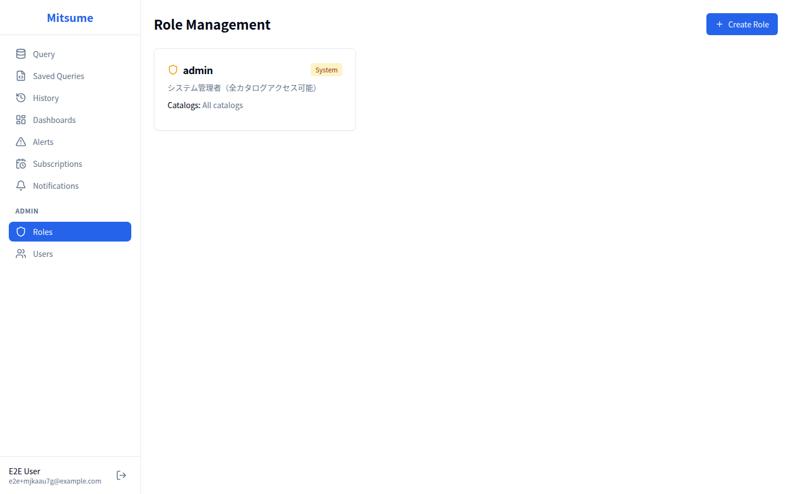

# ロール管理

ロール管理は、ロールの作成・編集と、各ロールがアクセスできるカタログの設定を行う機能です。
この機能は **管理者（admin ロールを持つユーザー）** のみがアクセスできます。

## アクセス方法

1. サイドバーの **Admin** セクションを展開します
2. **Role Management** をクリックします

> **注意**: この画面は管理者のみがアクセスできます。一般ユーザーはアクセスできません。

## 画面構成



## ロールの概念

ロールは、ユーザーがアクセスできるカタログを制御するための仕組みです。

### ロールの種類

| 種別 | 説明 | 編集可否 | 削除可否 |
|------|------|---------|---------|
| **System** | システム定義ロール（admin） | 説明のみ | 不可 |
| **Custom** | ユーザー定義ロール | 可能 | 可能 |

### admin ロール（システムロール）

- システムに組み込まれた特別なロール
- すべてのカタログにアクセス可能
- 管理画面にアクセス可能
- 編集・削除不可

## 基本的な使い方

### ロールの作成

1. **Create Role** ボタンをクリックします
2. ダイアログで以下を入力します:
   - **Name**: ロールの識別名（英数字推奨）
   - **Description**: ロールの説明
3. **Create** をクリックします
4. ロールが作成されます（この時点ではカタログ未設定）

### カタログ権限の設定

ロールにカタログへのアクセス権限を設定します。

1. ロールカードの **📁 Catalogs** ボタンをクリックします
2. カタログ選択ダイアログが開きます
3. アクセスを許可するカタログのチェックボックスをオンにします
4. **Save** をクリックして保存します

### ロールの編集

1. ロールカードの **✏️** ボタンをクリックします
2. 編集ダイアログが開きます
3. 名前や説明を変更して **Update** をクリックします

### ロールの削除

1. ロールカードの **🗑️** ボタンをクリックします
2. 確認ダイアログで **Delete** をクリックします

> **注意**: 削除されたロールは復元できません。このロールが割り当てられているユーザーからも自動的に削除されます。

## カタログ権限の仕組み

### 権限モデル

```
┌─────────────────────────────────────────────┐
│                   ユーザー                   │
│           (例: tanaka@example.com)          │
└─────────────────┬───────────────────────────┘
                  │ has
                  ▼
┌─────────────────────────────────────────────┐
│                   ロール                     │
│              (例: sales, analyst)           │
└─────────────────┬───────────────────────────┘
                  │ grants access to
                  ▼
┌─────────────────────────────────────────────┐
│                 カタログ                     │
│        (例: sales_db, analytics_db)         │
└─────────────────────────────────────────────┘
```

### アクセス判定フロー

1. ユーザーがカタログにアクセスを試みる
2. ユーザーに割り当てられたロールを確認
3. いずれかのロールがそのカタログへのアクセス権を持っていれば許可
4. どのロールもアクセス権を持っていなければ拒否

### 権限の加算

複数のロールを持つユーザーは、すべてのロールの権限の合計（和集合）を持ちます。

**例**:
- `sales` ロール: `sales_db` へのアクセス
- `analyst` ロール: `analytics_db` へのアクセス
- 両方のロールを持つユーザー: `sales_db` と `analytics_db` の両方にアクセス可能

## 設計例

### 部署ベースのロール設計

```
┌─────────────────────────────────────────────────────────────┐
│  ロール設計例                                                │
├───────────────────┬─────────────────────────────────────────┤
│  admin            │ すべてのカタログ（システム管理用）        │
├───────────────────┼─────────────────────────────────────────┤
│  sales            │ sales_db, crm_db, shared_db             │
├───────────────────┼─────────────────────────────────────────┤
│  marketing        │ marketing_db, analytics_db, shared_db   │
├───────────────────┼─────────────────────────────────────────┤
│  finance          │ finance_db, accounting_db, shared_db    │
├───────────────────┼─────────────────────────────────────────┤
│  analyst          │ analytics_db, datalake_db               │
└───────────────────┴─────────────────────────────────────────┘
```

### プロジェクトベースのロール設計

```
┌─────────────────────────────────────────────────────────────┐
│  ロール設計例                                                │
├───────────────────┬─────────────────────────────────────────┤
│  admin            │ すべてのカタログ                         │
├───────────────────┼─────────────────────────────────────────┤
│  project_alpha    │ alpha_db, shared_db                     │
├───────────────────┼─────────────────────────────────────────┤
│  project_beta     │ beta_db, shared_db                      │
├───────────────────┼─────────────────────────────────────────┤
│  data_platform    │ datalake_db, staging_db, shared_db      │
└───────────────────┴─────────────────────────────────────────┘
```

## カード表示情報

各ロールカードには以下が表示されます:

| 項目 | 説明 |
|------|------|
| **名前** | ロールの識別名 |
| **[System] バッジ** | システムロールの場合に表示 |
| **説明** | ロールの説明 |
| **Catalogs** | アクセス可能なカタログ一覧 |

### Catalogs 表示

| 表示 | 意味 |
|------|------|
| **All catalogs** | すべてのカタログにアクセス可能（admin ロール） |
| **catalog1, catalog2** | 指定されたカタログにアクセス可能 |
| **None** | カタログが設定されていない |

## 状態表示

### ローディング状態

データ読み込み中はスケルトンローダーが表示されます。

### エラー状態

読み込みに失敗した場合:
- エラーメッセージが表示されます
- **Retry** ボタンで再読み込みできます

### 空の状態

カスタムロールがない場合（admin ロールのみ）:
- 「No roles configured」メッセージが表示されます
- **Create Role** ボタンでロールを作成できます

## ベストプラクティス

### ロール名の命名規則

| 推奨 | 非推奨 |
|------|--------|
| `sales` | `Sales Team` |
| `data_analyst` | `データ分析者` |
| `project_alpha` | `プロジェクトA` |

- 英数字とアンダースコアを使用
- 小文字で統一
- 短く明確な名前

### ロール設計のコツ

1. **シンプルに保つ**: ロール数は最小限に
2. **重複を避ける**: 同じカタログを複数のロールに設定しすぎない
3. **ドキュメント化**: 各ロールの目的を説明に記載

### 定期的な見直し

1. **使われていないロールの削除**: 誰にも割り当てられていないロールを整理
2. **カタログの更新**: 新しいカタログが追加されたら適切なロールに追加
3. **権限の見直し**: 業務変更に合わせてロールを更新

## 関連ドキュメント

- [ユーザー管理](./user-management.md) - ユーザーへのロール割り当て
