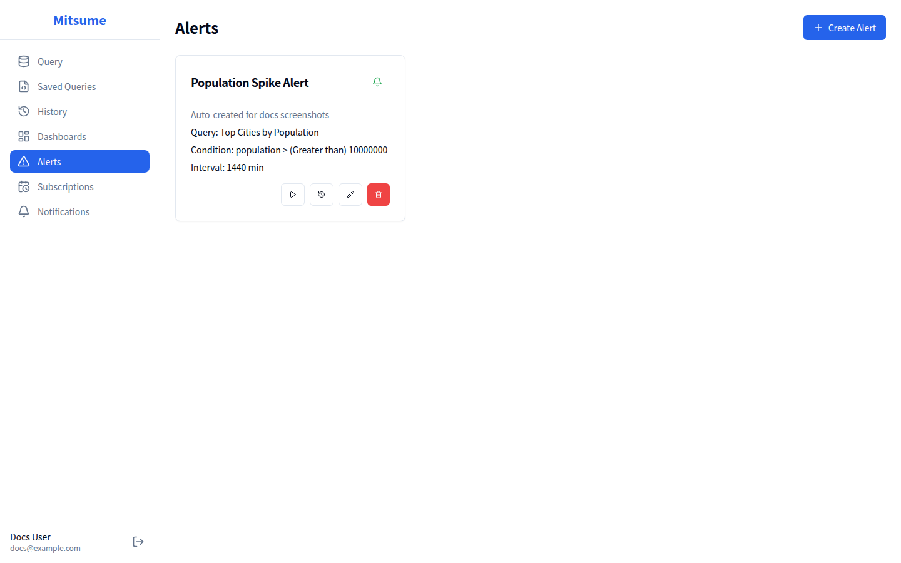

# アラート

アラートは、保存クエリの実行結果を定期的に監視し、指定した条件を満たした場合に通知を送信する機能です。

## 画面構成



## 基本的な使い方

### アラートの作成

1. サイドバーから **Alerts** をクリックします
2. **Create Alert** ボタンをクリックします
3. アラート設定ダイアログで以下を入力します

#### 基本設定

| 項目 | 説明 | 必須 |
|------|------|------|
| **Alert Name** | アラートの識別名 | ✓ |
| **Description** | アラートの説明 | |
| **Saved Query** | 監視対象のクエリ | ✓ |

#### 条件設定

| 項目 | 説明 | 必須 |
|------|------|------|
| **Column** | 監視する列名 | ✓ |
| **Operator** | 比較演算子 | ✓ |
| **Threshold** | しきい値 | ✓ |
| **Aggregation** | 複数行の場合の集計方法 | ✓ |

#### スケジュール設定

| 項目 | 説明 | 必須 |
|------|------|------|
| **Check Interval** | 監視間隔（分） | ✓ |
| **Cooldown** | 再通知までの待機時間（分） | ✓ |

#### 通知設定

| 項目 | 説明 | 必須 |
|------|------|------|
| **Notification Channels** | 通知先のチャンネル | |

4. **Create** をクリックしてアラートを作成します

### 比較演算子

| 演算子 | 説明 | 例 |
|--------|------|-----|
| `>` (Greater than) | より大きい | `error_rate > 5` |
| `<` (Less than) | より小さい | `stock < 10` |
| `=` (Equals) | 等しい | `status = 'error'` |
| `>=` (Greater or equal) | 以上 | `count >= 100` |
| `<=` (Less or equal) | 以下 | `latency <= 1000` |
| `!=` (Not equals) | 等しくない | `status != 'success'` |
| `Contains` | 含む | `message contains 'error'` |

### 集計方法

クエリ結果が複数行の場合、どのように値を集計するかを指定します。

| 集計方法 | 説明 |
|----------|------|
| **First row value** | 最初の行の値を使用 |
| **Sum** | 合計値 |
| **Average** | 平均値 |
| **Count** | 行数 |
| **Minimum** | 最小値 |
| **Maximum** | 最大値 |

### アラートの有効化/無効化

アラートは有効/無効を切り替えられます。

1. アラートカードのベルアイコンをクリックします
   - 🔔（緑）: 有効 → クリックで無効化
   - 🔕（グレー）: 無効 → クリックで有効化
2. 無効化されたアラートは監視が停止されます

### アラートのテスト

アラートを実際にトリガーせずに、現在の状態を確認できます。

1. アラートカードの **▶** ボタンをクリックします
2. クエリが実行され、結果が表示されます:
   - **トリガーする場合**: 「Alert would trigger: Current value: xxx」
   - **トリガーしない場合**: 「Alert would not trigger: Current value: xxx」

### アラート履歴の確認

過去のアラート発火履歴を確認できます。

1. アラートカードの **📋** ボタンをクリックします
2. 履歴ダイアログが開きます
3. 以下の情報が表示されます:
   - **Triggered At**: 発火日時
   - **Value**: 発火時の値
   - **Status**: 通知の送信状態（sent / failed）

### アラートの編集

1. アラートカードの **✏️** ボタンをクリックします
2. 編集ダイアログが開きます
3. 設定を変更して **Update** をクリックします

> **注意**: 監視対象のクエリは変更できません。クエリを変更する場合は、新しいアラートを作成してください。

### アラートの削除

1. アラートカードの **🗑️** ボタンをクリックします
2. 確認ダイアログで **Delete** をクリックします

## アラートの動作

### 監視フロー

```
┌─────────────────┐
│ Check Interval  │  ← 設定した間隔で繰り返し
│ 経過            │
└────────┬────────┘
         ↓
┌────────┴────────┐
│ クエリ実行       │
└────────┬────────┘
         ↓
┌────────┴────────┐
│ 条件判定         │
└────────┬────────┘
         ↓
    ┌────┴────┐
    │条件を満たす│
    └────┬────┘
         ↓           ↓ (満たさない)
    ┌────┴────┐      │
    │Cooldown中?│     │
    └────┬────┘      │
         ↓ No        │
    ┌────┴────┐      │
    │ 通知送信  │      │
    └────┬────┘      │
         ↓           │
    ┌────┴────┐      │
    │ 履歴記録  │      │
    └─────────┘      ↓
              ┌──────┴──────┐
              │ 次の間隔まで待機│
              └─────────────┘
```

### Cooldown（クールダウン）

連続した通知を防ぐための待機時間です。

- アラートが発火した後、Cooldown 期間中は再度発火しません
- 例: Cooldown が 60 分の場合、1 回発火すると次の 60 分間は発火しません

## アラートの設計例

### 例1: エラー率監視

**目的**: API のエラー率が 5% を超えたら通知

**クエリ**:
```sql
SELECT
    (SUM(CASE WHEN status >= 500 THEN 1 ELSE 0 END) * 100.0 / COUNT(*)) AS error_rate
FROM api_logs
WHERE timestamp >= NOW() - INTERVAL '1' HOUR
```

**アラート設定**:
- Column: `error_rate`
- Operator: `> (Greater than)`
- Threshold: `5`
- Aggregation: `First row value`
- Check Interval: `5` 分
- Cooldown: `30` 分

### 例2: 在庫切れ監視

**目的**: 在庫が 10 個以下の商品があれば通知

**クエリ**:
```sql
SELECT product_name, stock
FROM products
WHERE stock <= 10
```

**アラート設定**:
- Column: `stock`
- Operator: `<= (Less or equal)`
- Threshold: `10`
- Aggregation: `Count`（行数で判定）
- Check Interval: `30` 分
- Cooldown: `60` 分

### 例3: 売上目標達成通知

**目的**: 日次売上が目標を達成したら通知

**クエリ**:
```sql
SELECT SUM(amount) AS daily_sales
FROM orders
WHERE order_date = CURRENT_DATE
```

**アラート設定**:
- Column: `daily_sales`
- Operator: `>= (Greater or equal)`
- Threshold: `1000000`
- Aggregation: `First row value`
- Check Interval: `60` 分
- Cooldown: `1440` 分（24時間）

## 状態表示

### ローディング状態

データ読み込み中はスケルトンローダーが表示されます。

### エラー状態

読み込みに失敗した場合:
- エラーメッセージが表示されます
- **Retry** ボタンで再読み込みできます

### 空の状態

アラートがない場合:
- 「No alerts configured」メッセージが表示されます
- **Create Alert** ボタンでアラートを作成できます

## 注意事項

1. **通知チャンネルの設定**: アラートを作成する前に、通知チャンネルを設定しておく必要があります
2. **クエリのパフォーマンス**: 監視間隔が短い場合、クエリは頻繁に実行されます。重いクエリは避けてください
3. **Cooldown の設定**: 短すぎる Cooldown は大量の通知を生成する可能性があります

## 関連ドキュメント

- [保存クエリ](./saved-queries.md) - 監視対象クエリの作成
- [通知チャンネル](./notification-channels.md) - 通知先の設定
