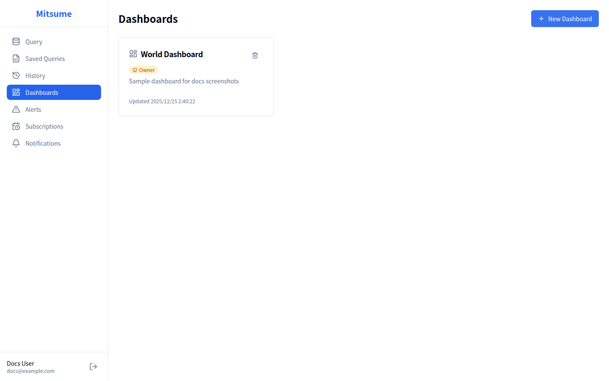
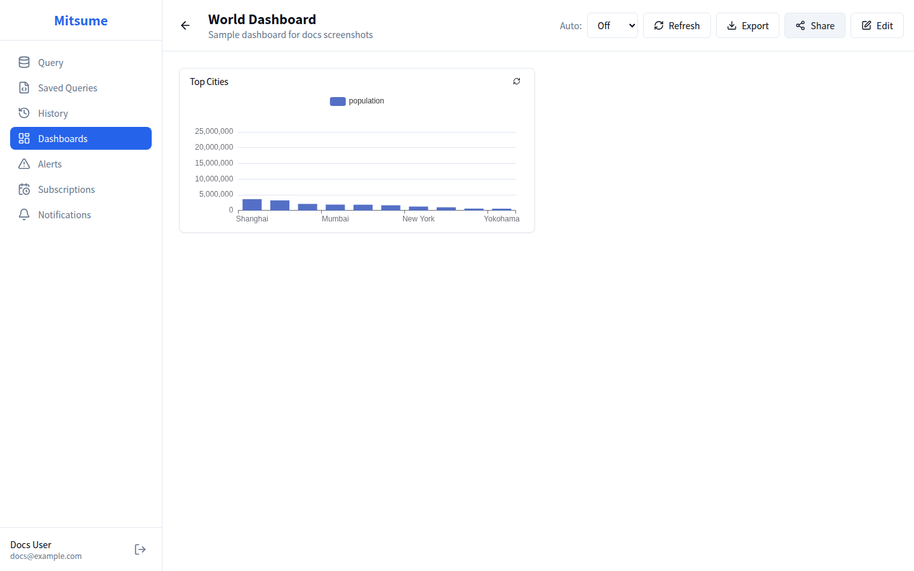

# ダッシュボード

ダッシュボードは、複数のクエリ結果をチャートやテーブルで可視化し、一覧表示するための機能です。
ドラッグ&ドロップでレイアウトを自由にカスタマイズできます。

## 画面構成

### ダッシュボード一覧



### ダッシュボード詳細



## 基本的な使い方

### ダッシュボードの作成

1. サイドバーから **Dashboards** をクリックします
2. **New Dashboard** ボタンをクリックします
3. ダイアログで以下を入力します:
   - **名前**: ダッシュボードの名前（必須）
   - **説明**: ダッシュボードの説明（任意）
4. **Create** をクリックします
5. 新しいダッシュボードが開きます

### ウィジェットの追加

1. ダッシュボード画面で **Edit** ボタンをクリックして編集モードにします
2. **Add Widget** ボタンをクリックします
3. ダイアログで以下を設定します:
   - **名前**: ウィジェットの表示名
   - **保存クエリ**: データソースとなるクエリを選択
   - **チャートタイプ**: 表示形式を選択
4. **Add** をクリックします
5. ウィジェットがダッシュボードに追加されます

### レイアウトの変更

編集モードでは、ウィジェットのレイアウトを自由に変更できます。

#### ドラッグで移動
1. ウィジェットのヘッダー部分をクリック&ドラッグします
2. 配置したい位置にドロップします

#### リサイズ
1. ウィジェットの右下角にカーソルを合わせます
2. リサイズハンドルをドラッグしてサイズを変更します

### ダッシュボードの保存

編集後は必ず保存してください。

1. **Save** ボタンをクリックします
2. 変更が保存されます
3. 編集モードが終了します

## チャートタイプ

### 基本チャート

| タイプ | 説明 | 適した用途 |
|--------|------|-----------|
| **Bar Chart** | 棒グラフ | カテゴリ別の比較 |
| **Line Chart** | 折れ線グラフ | 時系列データの推移 |
| **Pie Chart** | 円グラフ | 構成比の表示 |
| **Donut Chart** | ドーナツチャート | 構成比の表示（中心が空洞） |
| **Area Chart** | 面グラフ | 累積データの推移 |
| **Scatter Chart** | 散布図 | 2変数の相関 |
| **Bubble Chart** | バブルチャート | 3変数の相関（サイズで表現） |
| **Combo Chart** | コンボチャート | 棒と折れ線の組み合わせ |

### 分布・統計チャート

| タイプ | 説明 | 適した用途 |
|--------|------|-----------|
| **Heatmap** | ヒートマップ | 2次元データの密度表示 |
| **Boxplot** | 箱ひげ図 | データ分布の比較 |

### 階層・構成チャート

| タイプ | 説明 | 適した用途 |
|--------|------|-----------|
| **Treemap** | ツリーマップ | 階層データの比較 |
| **Sunburst** | サンバースト | 階層データの構成比 |
| **Funnel** | ファネルチャート | プロセスの段階表示 |

### 指標・KPIチャート

| タイプ | 説明 | 適した用途 |
|--------|------|-----------|
| **Counter (KPI)** | カウンター | 単一の数値指標 |
| **Gauge** | ゲージ | 目標に対する達成度 |
| **Progress** | プログレスバー | 進捗率の表示 |

### データ表示

| タイプ | 説明 | 適した用途 |
|--------|------|-----------|
| **Table** | テーブル | 詳細データの表示 |
| **Pivot Table** | ピボットテーブル | クロス集計 |
| **Text (Markdown)** | マークダウン | 説明テキストの表示 |

---

### チャート設定

各チャートタイプに応じた設定が可能です。

#### 軸の設定（棒・折れ線・面・散布図）
- **X軸**: 横軸に使用する列
- **Y軸**: 縦軸に使用する列（複数選択可）

#### スタッキング（棒・面）

棒グラフ/面グラフでは、複数系列を積み上げ表示できます。

| 設定 | 説明 |
|------|------|
| **No stacking** | 積み上げなし |
| **Stacked** | 通常の積み上げ |
| **100% Stacked** | 100% 積み上げ（割合表示） |

#### 円グラフ・ドーナツチャートの設定
- **ラベル列**: 各セグメントのラベル
- **値列**: 各セグメントの値

#### コンボチャートの設定
- **X軸**: 横軸に使用する列
- **Y軸**: 縦軸に使用する列（複数選択可）
- **系列タイプ**: 各系列の表示形式（bar / line / area）
- **2軸表示**: 第2Y軸を使用するかどうか

#### バブルチャートの設定
- **X軸**: 横軸に使用する列
- **Y軸**: 縦軸に使用する列
- **サイズ列**: クエリ結果の3列目がバブルサイズとして使用されます（UIでは変更できません）

#### ヒートマップの設定
- **X列**: 横軸に使用する列
- **Y列**: 縦軸に使用する列
- **値列**: 色の濃淡を決める値の列
- **カラースキーム**: 色のテーマ（blue / green / red / purple / diverging）
- **値表示**: セル内に数値を表示するかどうか

#### 箱ひげ図（Boxplot）の設定
- **カテゴリ列**: グループ分けに使用する列
- **値列**: 分布を表示する数値列

> **補足**: 外れ値は自動的に赤い点として表示されます。

#### ツリーマップの設定
- **ラベル列**: X軸で指定した列（未指定の場合は1列目）
- **値列**: クエリ結果の2列目（UIでは変更できません）

> **補足**: 階層（多段）ツリーマップの設定 UI は未提供です。フラットなカテゴリと値の2列で利用してください。

#### サンバーストの設定
- **ラベル列**: X軸で指定した列（未指定の場合は1列目）
- **値列**: クエリ結果の2列目（UIでは変更できません）

> **補足**: 階層（多段）サンバーストの設定 UI は未提供です。フラットなカテゴリと値の2列で利用してください。

#### ファネルチャートの設定
- **ラベル列**: X軸で指定した列（未指定の場合は1列目）
- **値列**: クエリ結果の2列目（UIでは変更できません）

> **補足**: 値の降順で表示されます。

#### ゲージの設定
- **値列**: 表示する数値の列
- **ラベル**: 表示ラベル（任意）
- **最小値**: ゲージの最小値
- **最大値**: ゲージの最大値
- **ポインター表示**: 針を表示するかどうか

#### プログレスバーの設定
- **値列**: 現在の値の列
- **ラベル**: 表示ラベル（任意）
- **目標値**: 達成目標の値
- **パーセント表示**: 進捗率を表示するかどうか
- **色**: プログレスバーの色

#### カウンターの設定
- **値列**: 表示する数値の列
- **ラベル**: 表示ラベル（任意）
- **プレフィックス**: 数値の前に表示するテキスト（例: ¥）
- **サフィックス**: 数値の後に表示するテキスト（例: 件）
- **比較（任意）**:
  - Previous Row: 2行目を「前回値」として増減を表示
  - Target: 目標値（Target Value）に対する増減を表示
- **条件付き書式（任意）**: しきい値に応じて背景色/文字色を変更
- **スパークライン（任意）**: 値の推移をミニチャートで表示

#### ピボットテーブルの設定
- **行**: 行ヘッダーに使用する列
- **列**: 列ヘッダーに使用する列
- **値**: 集計する値の列
- **集計**: sum / count / avg / min / max

---

### カラースキーム（ヒートマップ）

ヒートマップではカラースキームを選択できます（`blue / green / red / purple / diverging`）。
他のチャートの配色は現状 ECharts のデフォルト設定に従います。

### 時系列オプション

時系列データを扱うチャート（折れ線グラフ、面グラフなど）では、追加の分析オプションが利用可能です。

#### 時間粒度（Granularity）

データを任意の時間単位で集計できます。

| 粒度 | 説明 |
|------|------|
| **Hour** | 時間単位で集計 |
| **Day** | 日単位で集計 |
| **Week** | 週単位で集計（月曜始まり） |
| **Month** | 月単位で集計 |
| **Quarter** | 四半期単位で集計 |
| **Year** | 年単位で集計 |

#### 移動平均（Rolling Window）

データのトレンドを把握しやすくするために移動平均を表示できます。

- **期間**: 平均を計算する期間（例: 7日間）
- **関数**: mean（平均）、sum（合計）、min（最小）、max（最大）

#### 累積値（Cumulative）

累積値を表示してトレンドの把握を容易にします。

#### Data Zoom

棒・折れ線・面グラフでは、データが多い場合にズーム操作を有効化できます。

- **Slider**: 下部にスライダーを表示
- **Mouse Scroll**: マウスホイールでズーム（内側ズーム）
- **Both**: 両方

## ウィジェットの操作

### ウィジェットの編集

1. 編集モードでウィジェットの設定アイコン（⚙️）をクリックします
2. 設定ダイアログが開きます
3. 設定を変更して **Save** をクリックします

### ウィジェットの削除

1. 編集モードでウィジェットの削除アイコン（🗑️）をクリックします
2. 確認ダイアログで **Delete** をクリックします

### 個別のリフレッシュ

各ウィジェットは個別にデータを更新できます。

1. ウィジェットのリフレッシュアイコン（🔄）をクリックします
2. クエリが再実行され、データが更新されます

### ドリルダウン（クリックで別ダッシュボードへ遷移）

ウィジェットから別のダッシュボードへ遷移し、クリックした値をパラメータとして渡せます（URLの `p_` パラメータ）。

#### チャートのクリック（Bar/Line/Pie など）
1. 編集モードでウィジェットの設定アイコン（⚙️）をクリックします
2. **Click Action (Drilldown)** で **Enable drilldown** をオンにします
3. **Target Dashboard** を選択します
4. **Parameter Mapping** で渡したい値を設定します（例: `country = name`）

#### テーブルのセルリンク（Table）
1. 編集モードでウィジェットの設定アイコン（⚙️）をクリックします
2. **Column Links (Drilldown)** でリンクにしたい列を有効化します
3. **Target Dashboard** を選択します
4. **Parameter Mapping** を設定します（`@` はそのセル値）
5. 必要なら **Display Text** に `View {{@}}` のようなテンプレートを設定します

## データの更新

### 手動更新

**Refresh** ボタンをクリックすると、すべてのウィジェットのデータが更新されます。

### 自動更新

ダッシュボードを自動的に更新する間隔を設定できます。

1. **Auto Refresh** ドロップダウンをクリックします
2. 更新間隔を選択します:
   - **Off**: 自動更新なし
   - **30s**: 30秒ごと
   - **1m**: 1分ごと
   - **5m**: 5分ごと
   - **10m**: 10分ごと
3. 選択した間隔でダッシュボードが自動更新されます

## パラメータ

ダッシュボードのクエリにパラメータを設定できます。

### パラメータの定義

保存クエリで `{{パラメータ名}}` 形式でパラメータを定義します。

```sql
SELECT * FROM orders
WHERE order_date >= DATE '{{start_date}}'
  AND category = '{{category}}'
```

### パラメータの使用

1. パラメータが設定されたクエリを使用するウィジェットを追加します
2. ダッシュボード上部にパラメータ入力欄が表示されます
3. パラメータ値を入力します
4. 入力に応じて、すべてのウィジェットが新しいパラメータ値で更新されます

### パラメータのURL共有

パラメータ値はURLに自動的に反映されます。これにより、特定のパラメータ設定でダッシュボードを共有できます。

**URL形式**:
```
/dashboards/{id}?p_start_date=2024-01-01&p_category=Electronics
```

- パラメータは `p_` プレフィックスを付けてクエリパラメータとして指定
- このURLをブックマークしたり、他のユーザーと共有可能

## 共有

### ダッシュボードの共有

1. **Share** ボタンをクリックします
2. 共有ダイアログが開きます
3. 共有先（ユーザー/ロール）とアクセス権限を設定します:
   - **View**: 閲覧のみ
   - **Edit**: 編集可能
4. 追加ボタン（＋）をクリックして権限を付与します

### 公開設定

ダッシュボードを全ユーザーに公開できます。

1. 共有ダイアログで **Public** トグルをオンにします
2. ダッシュボードが全ユーザーから閲覧可能になります

### 権限レベル

| レベル | 閲覧 | 編集 | 削除 | 共有設定 |
|--------|-----|------|------|---------|
| Owner | ✓ | ✓ | ✓ | ✓ |
| Edit | ✓ | ✓ | - | - |
| View | ✓ | - | - | - |

### 権限バッジ

ダッシュボード詳細画面では、現在の権限レベルがバッジで表示されます。

| バッジ | 説明 |
|--------|------|
| 👁️ **View Only** | 閲覧のみ可能 |
| ✏️ **Can Edit** | 編集可能 |
| 🌐 **Public** | 公開ダッシュボード |

## エクスポート

ダッシュボードを画像やPDFとしてエクスポートできます。

1. **Export** ボタンをクリックします
2. ファイル名と形式を選択します:
   - **PNG**: 画像形式
   - **PDF**: PDF形式
3. ファイルがダウンロードされます

## 状態表示

### ローディング状態

ウィジェットのデータ読み込み中はスケルトンローダーが表示されます。

### エラー状態

クエリ実行に失敗した場合:
- エラーメッセージが表示されます
- **Retry** ボタンで再実行できます

### 空の状態

ウィジェットがない場合:
- 「Add widgets to get started」メッセージが表示されます
- **Add Widget** ボタンでウィジェットを追加できます

## ベストプラクティス

### レイアウト設計

1. **重要な指標を上部に**: KPI やサマリーを画面上部に配置
2. **関連するウィジェットをグループ化**: 同じテーマのウィジェットを近くに配置
3. **適切なサイズ**: 情報量に応じたウィジェットサイズを設定

### パフォーマンス

1. **クエリの最適化**: 重いクエリはダッシュボードの読み込みを遅くします
2. **ウィジェット数の適正化**: 多すぎるウィジェットは読み込み時間を増加させます
3. **自動更新の間隔**: 短すぎる間隔はサーバー負荷を増加させます

## 関連ドキュメント

- [保存クエリ](./saved-queries.md) - ウィジェットで使用するクエリの管理
- [サブスクリプション](./subscriptions.md) - ダッシュボードの定期配信
