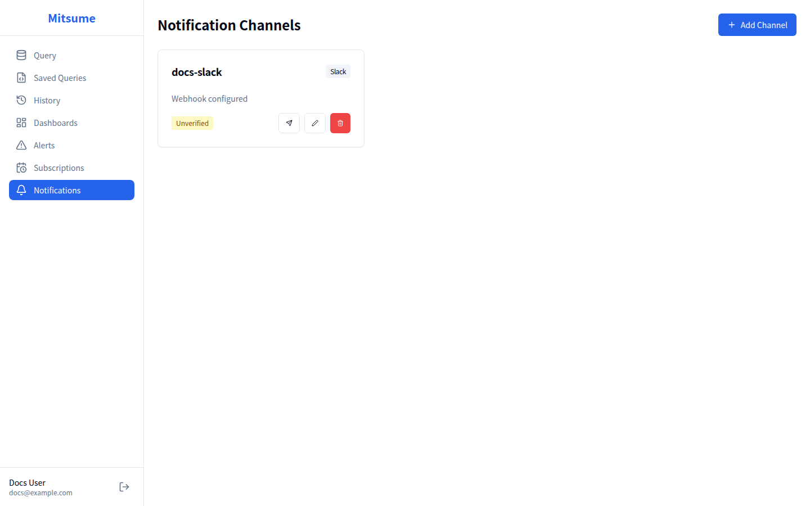

# 通知チャンネル

通知チャンネルは、アラートやサブスクリプションの通知を送信する宛先を設定する機能です。
Slack、Email、Google Chat に対応しています。

## 画面構成



## 対応チャンネルタイプ

| タイプ | 説明 | 必要な設定 |
|--------|------|-----------|
| **Slack** | Slack ワークスペースへの通知 | Webhook URL |
| **Email** | メールアドレスへの通知 | 宛先メールアドレス |
| **Google Chat** | Google Chat スペースへの通知 | Webhook URL |

## 基本的な使い方

### チャンネルの追加

1. サイドバーから **Notifications** をクリックします
2. **Add Channel** ボタンをクリックします
3. 設定ダイアログで以下を入力します

#### 基本設定

| 項目 | 説明 | 必須 |
|------|------|------|
| **Name** | チャンネルの識別名 | ✓ |
| **Channel Type** | チャンネルの種類 | ✓ |

#### Slack の場合

| 項目 | 説明 | 必須 |
|------|------|------|
| **Webhook URL** | Slack の Incoming Webhook URL | ✓ |

#### Google Chat の場合

| 項目 | 説明 | 必須 |
|------|------|------|
| **Webhook URL** | Google Chat の Webhook URL | ✓ |

#### Email の場合

| 項目 | 説明 | 必須 |
|------|------|------|
| **Recipients** | 宛先メールアドレス（カンマ区切りで複数可） | ✓ |

4. **Create** をクリックしてチャンネルを作成します

### テスト送信

チャンネルが正しく設定されているか確認するため、テスト通知を送信できます。

1. チャンネルカードの **📤** ボタンをクリックします
2. テスト通知が送信されます
3. 成功すると「Test sent」メッセージが表示されます
4. 受信側で通知が届いていることを確認してください

### チャンネルの編集

1. チャンネルカードの **✏️** ボタンをクリックします
2. 編集ダイアログが開きます
3. 設定を変更して **Update** をクリックします

> **注意**: チャンネルタイプは変更できません。タイプを変更する場合は、新しいチャンネルを作成してください。

### チャンネルの削除

1. チャンネルカードの **🗑️** ボタンをクリックします
2. 確認ダイアログで **Delete** をクリックします

> **注意**: このチャンネルを使用しているアラートやサブスクリプションがある場合、それらの通知も停止されます。

## チャンネル別設定ガイド

### Slack の設定

#### 1. Incoming Webhook の作成

1. Slack の管理画面で **Apps** にアクセスします
2. **Incoming Webhooks** を検索してインストールします
3. **Add New Webhook to Workspace** をクリックします
4. 通知を送信するチャンネルを選択します
5. **Allow** をクリックします
6. 生成された **Webhook URL** をコピーします

```
https://hooks.slack.com/services/<YOUR-WORKSPACE-ID>/<YOUR-CHANNEL-ID>/<YOUR-SECRET-TOKEN>
```

#### 2. Mitsume での設定

1. Mitsume で **Add Channel** をクリックします
2. 以下を入力します:
   - **Name**: `#sales-alerts`（任意の識別名）
   - **Channel Type**: `Slack`
   - **Webhook URL**: コピーした Webhook URL
3. **Create** をクリックします

#### 3. テスト送信

1. 作成したチャンネルの **📤** ボタンをクリックします
2. Slack チャンネルにテストメッセージが届くことを確認します

### Google Chat の設定

#### 1. Webhook の作成

1. Google Chat でスペースを開きます
2. スペース名の横のドロップダウンメニューをクリックします
3. **Apps & integrations** を選択します
4. **Manage webhooks** をクリックします
5. **Create a Webhook** をクリックします
6. Webhook の名前を入力します
7. 生成された **Webhook URL** をコピーします

```
https://chat.googleapis.com/v1/spaces/XXXXXXXXXX/messages?key=YYYYYY&token=ZZZZZZ
```

#### 2. Mitsume での設定

1. Mitsume で **Add Channel** をクリックします
2. 以下を入力します:
   - **Name**: `Google Chat Alerts`（任意の識別名）
   - **Channel Type**: `Google Chat`
   - **Webhook URL**: コピーした Webhook URL
3. **Create** をクリックします

#### 3. テスト送信

1. 作成したチャンネルの **📤** ボタンをクリックします
2. Google Chat スペースにテストメッセージが届くことを確認します

### Email の設定

#### 1. Mitsume での設定

1. Mitsume で **Add Channel** をクリックします
2. 以下を入力します:
   - **Name**: `Alert Emails`（任意の識別名）
   - **Channel Type**: `Email`
   - **Recipients**: `alert@example.com, admin@example.com`
3. **Create** をクリックします

#### 2. テスト送信

1. 作成したチャンネルの **📤** ボタンをクリックします
2. 指定したメールアドレスにテストメールが届くことを確認します

> **注意**: Email 送信には、システム管理者がメールサーバー（SMTP）を設定している必要があります。

## 検証状態

チャンネルには検証状態があります。

| 状態 | 説明 |
|------|------|
| **Verified** ✓ | テスト送信が成功したチャンネル |
| **Unverified** ○ | まだテスト送信されていないチャンネル |

テスト送信が成功すると、自動的に **Verified** になります。

## 通知内容

### アラート通知

アラートがトリガーされた場合、以下の内容が送信されます:

- アラート名
- 条件（列名、演算子、しきい値）
- 実際の値
- トリガー時刻

**Slack での表示例**:
```
🚨 Alert: エラー率アラート
Condition: error_rate > 5
Current value: 7.5
Triggered at: 2024-01-15 10:30:00 JST
```

### サブスクリプション通知

スケジュールされたダッシュボード配信では、以下が送信されます:

- サブスクリプション名
- ダッシュボード名
- スケジュール
- 形式（PDF/PNG）

> **補足**: 現状のサブスクリプション通知は PDF/PNG の添付には対応していません。必要な場合はダッシュボード画面の **Export** を利用してください。

## 状態表示

### ローディング状態

データ読み込み中はスケルトンローダーが表示されます。

### エラー状態

読み込みに失敗した場合:
- エラーメッセージが表示されます
- **Retry** ボタンで再読み込みできます

### 空の状態

チャンネルがない場合:
- 「No notification channels」メッセージが表示されます
- **Add Channel** ボタンでチャンネルを追加できます

## トラブルシューティング

### Slack への通知が届かない

1. **Webhook URL が正しいか確認**: URL をコピーし直してみてください
2. **Slack チャンネルが存在するか確認**: チャンネルが削除されていないか確認
3. **Webhook が無効化されていないか確認**: Slack 管理画面で確認

### Email が届かない

1. **迷惑メールフォルダを確認**: メールが迷惑メールに振り分けられている可能性があります
2. **メールアドレスが正しいか確認**: タイプミスがないか確認
3. **メールサーバーが設定されているか確認**: システム管理者に確認

### Google Chat への通知が届かない

1. **Webhook URL が正しいか確認**: URL をコピーし直してみてください
2. **スペースが存在するか確認**: スペースが削除されていないか確認
3. **Webhook が有効か確認**: Google Chat 設定で確認

## 関連ドキュメント

- [アラート](./alerts.md) - アラート通知の設定
- [サブスクリプション](./subscriptions.md) - ダッシュボード配信の設定
