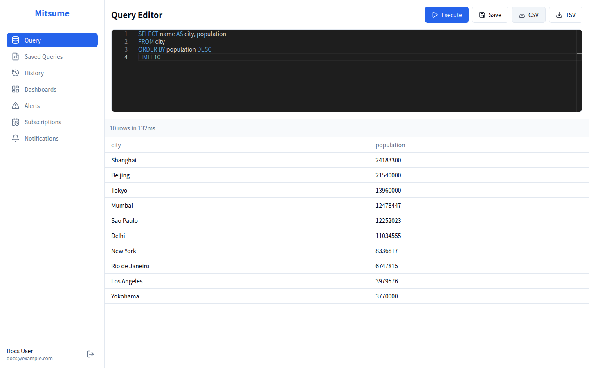

# クエリエディタ

クエリエディタは、SQL クエリを作成・実行し、結果を確認するための機能です。

## 画面構成



## 基本的な使い方

### 1. クエリの入力

SQL エディタに Trino SQL クエリを入力します。

> **補足**: Mitsume の接続先カタログ/スキーマはサーバー設定のデフォルトで実行されます。必要に応じて SQL 内で `catalog.schema.table` のように完全修飾名を使用してください。

```sql
SELECT
    customer_id,
    COUNT(*) as order_count,
    SUM(total_amount) as total_spent
FROM orders
WHERE order_date >= DATE '2024-01-01'
GROUP BY customer_id
ORDER BY total_spent DESC
LIMIT 100
```

#### エディタの機能

- **シンタックスハイライト**: SQL キーワード、文字列、数値などが色分け表示されます
- **オートコンプリート**: `Ctrl+Space` で入力補完候補が表示されます
- **行番号表示**: 左側に行番号が表示されます

#### キーボードショートカット

| ショートカット | 動作 |
|---------------|------|
| `Ctrl+Enter` / `Cmd+Enter` | クエリを実行 |
| `Ctrl+F` / `Cmd+F` | 検索（Monaco Editor 標準） |
| `Ctrl+H` / `Cmd+H` | 置換（Monaco Editor 標準） |

### 2. クエリの実行

1. **Execute** ボタンをクリック、または `Ctrl+Enter` を押します
2. クエリが Trino に送信され、実行されます
3. 実行中はローディング表示が出ます
4. 完了すると結果がテーブル形式で表示されます

#### 実行結果の表示

- **成功時**: 結果テーブルと実行統計（実行時間、取得行数）が表示されます
- **エラー時**: エラーメッセージが赤色で表示されます

### 3. 結果の確認

クエリ結果はテーブル形式で表示されます。

- **実行統計**: 「xx rows in yyms」が表示されます
- **結果テーブル**: 取得した rows/columns をそのまま表示します

> **補足**: 並び替えや絞り込みは UI ではなく SQL（`ORDER BY` / `WHERE`）で行ってください。

### 4. 結果のエクスポート

クエリ結果をファイルとしてダウンロードできます。

1. 実行後に表示される **CSV** / **TSV** ボタンをクリックします
2. ファイル名を入力します
3. **Export** をクリックするとダウンロードされます

## クエリの保存

よく使うクエリは保存して再利用できます。

1. クエリを入力した状態で **Save** ボタンをクリックします
2. ダイアログが表示されます:
   - **名前**: クエリの識別名（必須）
   - **説明**: クエリの用途や内容の説明（任意）
3. **Save** をクリックして保存します

保存したクエリは「Saved Queries」ページで管理できます。

## エラー対処

### よくあるエラー

| エラーメッセージ | 原因 | 対処法 |
|-----------------|------|--------|
| `Table 'xxx' does not exist` | テーブルが存在しない | カタログ・スキーマを確認 |
| `Column 'xxx' cannot be resolved` | 列名が間違っている | 正しい列名を確認 |
| `Query exceeded maximum time limit` | クエリがタイムアウト | クエリを最適化するか、LIMIT を追加 |
| `Access Denied` | 権限がない | 管理者に権限を確認 |

### ネットワークエラー

接続エラーが発生した場合:

1. 「Retry」ボタンをクリックして再試行します
2. 繰り返しエラーが発生する場合は、管理者に連絡してください

## ベストプラクティス

### パフォーマンス向上のコツ

1. **LIMIT を使用する**: 結果件数を制限してレスポンスを高速化
   ```sql
   SELECT * FROM large_table LIMIT 1000
   ```

2. **必要な列のみ選択**: `SELECT *` を避け、必要な列を明示
   ```sql
   SELECT id, name, created_at FROM users  -- 推奨
   SELECT * FROM users                      -- 非推奨
   ```

3. **WHERE 句でフィルタリング**: 早い段階でデータを絞り込み
   ```sql
   SELECT * FROM events WHERE event_date >= DATE '2024-01-01'
   ```

4. **パーティション列を活用**: パーティションキーで絞り込み
   ```sql
   SELECT * FROM logs WHERE dt = '2024-01-15'
   ```

### SQL の書き方

1. **キーワードは大文字**: 可読性向上のため
   ```sql
   SELECT id, name FROM users WHERE status = 'active'
   ```

2. **エイリアスを使用**: 複雑なクエリでは列・テーブルにエイリアスを付与
   ```sql
   SELECT
       u.id,
       u.name,
       COUNT(o.id) AS order_count
   FROM users u
   LEFT JOIN orders o ON u.id = o.user_id
   GROUP BY u.id, u.name
   ```

## 関連ドキュメント

- [保存クエリ](./saved-queries.md) - クエリの保存と管理
- [クエリ履歴](./history.md) - 過去の実行履歴の確認
- [ダッシュボード](./dashboards.md) - クエリ結果の可視化
