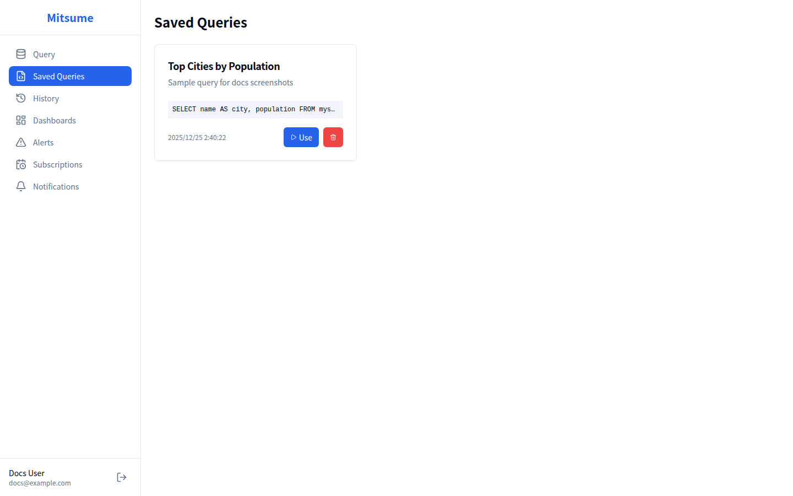

# 保存クエリ

保存クエリは、よく使う SQL クエリを保存して再利用するための機能です。
保存したクエリは、ダッシュボードのウィジェットやアラートの監視対象としても使用できます。

## 画面構成



## 基本的な使い方

### クエリの保存

#### 方法1: クエリエディタから保存

1. クエリエディタでクエリを作成します
2. **Save** ボタンをクリックします
3. ダイアログで以下を入力します:
   - **名前**: クエリを識別する名前（必須）
   - **説明**: クエリの用途や内容の説明（任意）
4. **Save** をクリックして保存します

#### 方法2: 保存クエリ一覧から新規作成

1. サイドバーから **Saved** をクリックします
2. **New Query** ボタンをクリックします
3. クエリエディタが開きます
4. クエリを入力して保存します

### 保存クエリの一覧表示

1. サイドバーから **Saved** をクリックします
2. 保存されているクエリがカード形式で表示されます

各カードには以下が表示されます:
- **名前**: クエリの識別名
- **説明**: クエリの説明（設定されている場合）
- **更新日時**: 最後に更新された日時
- **操作ボタン**: Edit / Use / Delete

### 保存クエリの使用

保存したクエリをクエリエディタで開いて実行できます。

1. 使用したいクエリのカードを見つけます
2. **Use** ボタンをクリックします
3. クエリエディタが開き、クエリが自動入力されます
4. 必要に応じて修正し、実行します

### 保存クエリの編集

1. 編集したいクエリのカードを見つけます
2. **Edit** ボタンをクリックします
3. 編集ダイアログが開きます:
   - **名前**: クエリ名を変更
   - **説明**: 説明を変更
   - **クエリ**: SQL を編集
4. **Update** をクリックして保存します

### 保存クエリの削除

1. 削除したいクエリのカードを見つけます
2. **Delete** ボタン（ゴミ箱アイコン）をクリックします
3. 確認ダイアログで **Delete** をクリックします

> **注意**: 削除されたクエリは復元できません。
> また、このクエリを使用しているダッシュボードウィジェットやアラートにも影響があります。

## 保存クエリの活用

### ダッシュボードウィジェットでの使用

保存クエリはダッシュボードのウィジェットで使用できます。

1. ダッシュボードで **Add Widget** をクリックします
2. **Saved Query** ドロップダウンから使用するクエリを選択します
3. チャートタイプを選択します
4. ウィジェットが追加されます

詳細は [ダッシュボード](./dashboards.md) を参照してください。

### アラートでの使用

保存クエリを監視対象としてアラートを設定できます。

1. アラート作成画面で **Saved Query** を選択します
2. 監視条件を設定します
3. 条件が満たされると通知されます

詳細は [アラート](./alerts.md) を参照してください。

## 状態表示

### ローディング状態

データ読み込み中はスケルトンローダーが表示されます。

### エラー状態

読み込みに失敗した場合:
- エラーメッセージが表示されます
- **Retry** ボタンで再読み込みできます

### 空の状態

保存クエリがない場合:
- 「No saved queries」メッセージが表示されます
- **New Query** ボタンでクエリを作成できます

## ベストプラクティス

### 命名規則

わかりやすい名前を付けることで、後から探しやすくなります。

**良い例**:
- `日次売上レポート`
- `アクティブユーザー数（DAU/WAU/MAU）`
- `商品カテゴリ別在庫状況`

**悪い例**:
- `query1`
- `test`
- `新しいクエリ`

### 説明の書き方

説明には以下を含めると便利です:

1. **目的**: このクエリが何を調べるものか
2. **使用場面**: どのような時に使うか
3. **注意点**: 実行時間が長い場合や、特定条件がある場合

**例**:
```
目的: 日別の売上金額と注文件数を集計
使用場面: 日次の売上報告
注意点: 過去90日分のみ取得（それ以上は時間がかかる）
```

### 定期的な整理

- 使わなくなったクエリは削除しましょう
- 似たようなクエリは統合を検討しましょう
- 説明が古くなっていたら更新しましょう

## 関連ドキュメント

- [クエリエディタ](./query-editor.md) - クエリの作成と実行
- [ダッシュボード](./dashboards.md) - クエリ結果の可視化
- [アラート](./alerts.md) - クエリ結果の監視
